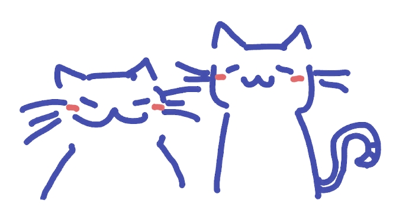

> Not to feel exasperated or defeated or despondent because your days aren't packed with wise and moral actions. But to get back up when you fail, to celebrate behaving like a human—however imperfectly—and fully embrace the pursuit you've embarked on.
> — Marcus Aurelius

## years III & IV
- [[4048]] — mathematics one
- [[4049]] — mathematics two
- [[6092]] — chemistry

## year V
- [[9758]] — h2 mathematics

## others
- [[quantus]] — quantum mechanics